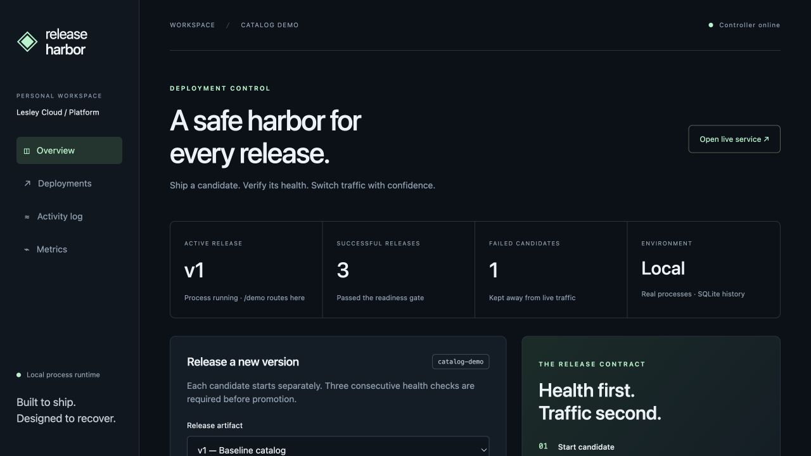
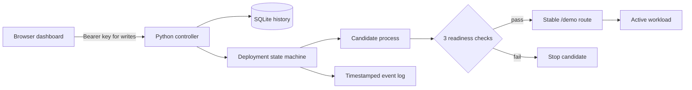

# Release Harbor

[](https://github.com/LesleyCloud1/release-harbor/actions/workflows/ci.yml)

**A deployment control plane that proves a release is healthy before it serves traffic.**

Built by Lesley Cloud to connect application engineering with CI/CD, release operations, and developer tooling. This is an independent portfolio project; it contains no employer code or infrastructure.



## Try it in two minutes

Python 3.11+ on macOS or Linux. No Python packages, Docker, cloud account, or API keys required.

```bash
python3 -m harbor.server
```

Open **http://127.0.0.1:8088**, then paste the operator key printed in the terminal into the dashboard. The key is generated for this controller session and stays in the page's memory. Keep the terminal open; Ctrl+C stops the controller and its workloads.

1. Deploy **v1**. Open the live service and inspect its JSON response.
2. Deploy **v2**. The desk lamp price changes from 32 to 29.
3. Deploy **v3-broken**. Its real HTTP health endpoint returns 503. The candidate fails; v2 continues serving.
4. Choose **Roll back**. A new v1 process passes the same readiness checks before taking traffic.
5. Read the activity log and deployment history to explain every decision.

History persists in `.harbor/state.db`. A restart preserves that history, but does not automatically redeploy a workload. Launch only one controller per database.

## What actually works

- Real isolated **child processes**, each with its own loopback HTTP port.
- Three consecutive readiness responses with version and health validation.
- A stable `/demo` route that switches only after the candidate passes.
- Failed-candidate cleanup; the previous active process remains untouched.
- Rollback as a **new checked deployment**, not a database label change.
- SQLite deployment records, timestamped events, artifact fingerprints, and Prometheus-format counters.
- Serialized deployments, clear conflict responses, graceful cleanup, and incomplete-operation recovery.
- A responsive dashboard with no frontend dependencies or external assets.
- A CI matrix, container smoke test, Terraform validation, and manually triggered GHCR publishing.

## Architecture



The included `catalog-demo` is a small, separate Python workload. **It is not EasyShop.** EasyShop integration is the next adapter milestone and needs MySQL, application configuration, and an appropriate health contract.

## API

| Method | Path | Purpose |
|---|---|---|
| GET | `/api/state` | Releases, active process, history, events, aggregate counts |
| POST | `/api/deploy` | JSON `{"version":"v1"}`; returns 202 with operation ID |
| POST | `/api/rollback` | Deploy most recent successful version different from active |
| GET | `/demo` | Proxy to the active real workload |
| GET | `/healthz` | Controller liveness |
| GET | `/metrics` | Deployment counts by status |

Writes require `Authorization: Bearer <operator-key>`. Unknown releases are rejected; the API never accepts arbitrary shell commands or URLs. This is a **local single-operator tool**, not a public multi-tenant deployment service. See [security boundaries](docs/SECURITY.md).

## Verify

```bash
python3 -m unittest discover -s tests -v
python3 -m compileall -q harbor
node --check harbor/static/app.js  # optional JS syntax check
```

The tests run real workloads and HTTP requests: promotion, failed candidate isolation, rollback, concurrent requests, history recovery, and API authorization. They do not require a cloud account.

## Optional infrastructure paths

**Docker:** `docker compose up --build`. Copy the generated key from the logs. The compose port is bound to your machine's loopback address. Named volume storage keeps history.

**GHCR:** manually run “Publish verified container” in GitHub Actions. The workflow tests first, then publishes a commit-tagged image with SBOM/provenance using the short-lived workflow token. Pull requests do not publish images.

**Kubernetes:** [catalog.yaml](deploy/kubernetes/catalog.yaml) runs the sample workload as a Deployment with readiness probes, restricted container privileges, resource limits, and a ClusterIP Service. Replace `IMAGE_PLACEHOLDER` with your published image digest. This is a separately operated workload example, **not an integrated Kubernetes dashboard backend**. See the [runbook](docs/RUNBOOK.md).

**AWS/Terraform:** `infra/registry` creates an optional ECR registry with immutable tags, scan-on-push, and untagged-image expiration. It does not provision EKS. GHCR publishing and ECR are separate alternatives; there is no automatic ECR push. Running `terraform apply` creates AWS resources and may incur charges. No AWS deployment is needed for the demo.

## Read the engineering story

- [Plain-language code tour](docs/CODE_TOUR.md)
- [Design decisions and tradeoffs](docs/DECISIONS.md)
- [Failure and rollback runbook](docs/RUNBOOK.md)
- [Security boundaries](docs/SECURITY.md)
- [Three-minute interview demo](docs/DEMO.md)
- [Verification record](docs/VERIFICATION.md)

## Next milestones

1. A Docker workload adapter for EasyShop and MySQL, with immutable image digests.
2. A Kubernetes adapter with reconciliation after controller restarts.
3. OIDC identities, role-based access, approval policies, and exported audit events.
4. Sustained post-promotion monitoring and configurable rollback policy.

The current source fingerprint identifies source + release configuration, not a signed container artifact. Readiness checks protect promotion; they do not guarantee permanent health. Those distinctions are intentional and documented.
